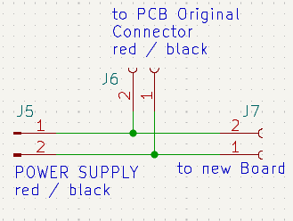
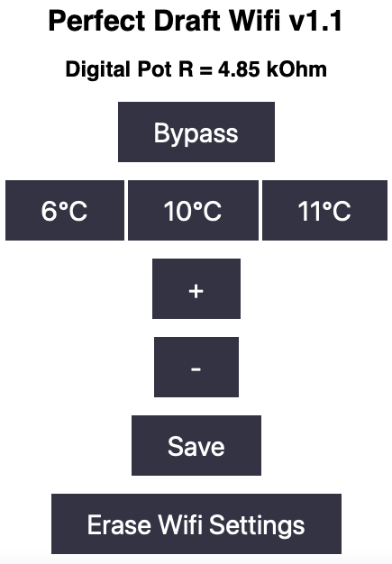

# Philips-PerfectDraft-Wifi-daughterboard
A daughterboard to the non-pro version of PerfectDraft beer dispenser that add Wifi and temperature control

```
Ther are a couple of older approaches with potentiometers and switches to set a desired beer temperature.
Standard configuration is 3°C and sometimes this is to cold. Or you want to save energy. Which is not possible.
Here you can build your own PCB or other board type to add Wifi capabilities to your Perfect Draft machine (not Pro).

NOTE: Please pay additional attention if you work with high-voltage electricial power. If you are not aware of security 
when working with electricial power dont do this project. I am not responsible if you hurt youself or others. 
Your household AC current is between 110 and 240 volts and can kill you. Wiring errors lead into fire or turn your 
project into a leathal weapon!This is a diy project and you have to know what you are doing and think before you 
do something. Ok, I am a notorious german and we love these safety instructions. 
```

```
Features: 
  Wifi enabled
  OTA Updates
  Set Cooling Temperature via Webbrowser http://PerfectDraft.local or IP
  Bypass your settings and use orginal NTC value (to see correct Temp after 5 Minutes)
  Use Fast Temp Buttons: 7°C
  Save your setting and use after every reboot
```


```
Use a digital potentiometer like X9C103S (10kOhm) and connect the Pins:
VCC to 5V Pin 1
GND to 5V Pin 2
CS  to D1 Mini Pin D1
INC to D1 Mini Pin D2
U/D to D1 Mini Pin D3
VL  to one of the wires from the NTC connector (PD PCB)
VW  to the wire you have choose before (see description below)
```


```
Remove the connector from PD PCB and add a Y connector. 
Choose one Pin from the PD PCB male connector labeled NTC and connect that wire to VL (X9C103S). 
The VW wire connect to the female connector (original) that was connected to the PD PCB before. 
The other Pin from the PCB labeled NTC connect directly to the female connector (original). 
```


```
It is possible to use the machines power supply as it is already DC and 10.6V - 
apply this standard stabilized power converter to get 5V DC from 10.6 V DC:

Input  Pin 1 to PD red wire
Input  Pin 2 to PD black wire
Output Pin 1 to D1 Mini Pin 5V
Output Pin 2 to D1 Mini Pin get

See the second picture below to build a power supply Y-connector. Use the same cable connectors and connect red to PCB and to LM7805 Input Pin 1 - same to the black wire but connect that to Input Pin 2 (GND).
```




```
For communication with the X9C103S digital potentiometer I use the following supporting library:
   https://github.com/lucyamy/LapX9C10X.git
I do not know if this lib will change and I have put latest working copy to Libs folder. 
Add this ZIP library to your project.

Ensure to change your SSID and credentials before uploading the firmware. See firmware/Credentials.h
Ensure to change the default OTA credentials before uploading - default OTA upload password is 'pd2023'
Build the firmware and if you have done the wiring correctly you can see the Perfect Draft Wifi Website:
```
<p style="text-align:center;"></p>

After compiling and uploading you should be able to connect to your hostname (see Credentials.h for setting hostname):
```
22:10:06.872 -> Ready
22:10:10.113 -> IP address: 358.11.122.42
22:10:10.113 -> Setup completed
22:10:49.272 -> Client available
22:10:49.272 -> GET / HTTP/1.1
22:10:49.272 -> Host: perfectdraft-neu.local
22:10:49.272 -> Upgrade-Insecure-Requests: 1
22:10:49.272 -> Accept: text/html,application/xhtml+xml,application/xml;q=0.9,*/*;q=0.8
22:10:49.272 -> User-Agent: Mozilla/5.0 (Macintosh; Intel Mac OS X 10_15_6) AppleWebKit/605.1.15 (KHTML, like Gecko) Version/14.0.2 Safari/605.1.15
22:10:49.272 -> Accept-Language: de-de
22:10:49.272 -> Accept-Encoding: gzip, deflate
22:10:49.305 -> Connection: keep-alive
22:10:49.305 -> 
22:10:49.305 -> Client disconnected
22:10:49.305 -> 
```
